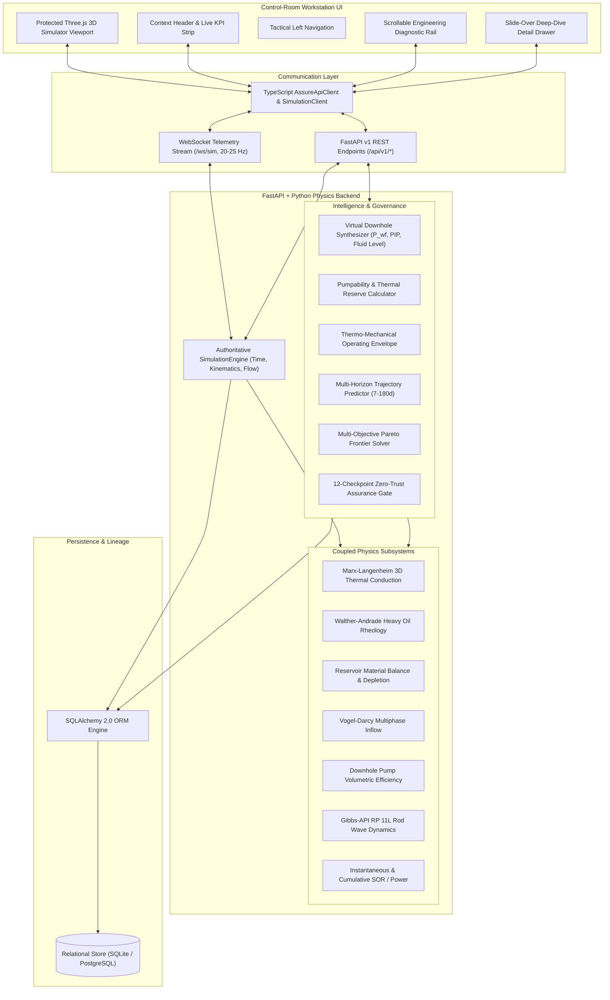

# ASSURE-TWIN System Architecture
## Well-to-Surface Digital Twin for CSS & SRP Operations (Baghewala Field)
**SIH 2026 — Problem Statement 26120**

---

### 1. Executive Architecture Overview

ASSURE-TWIN is a high-fidelity digital twin platform engineered for heavy oil wells operating under Cyclic Steam Stimulation (CSS) and Sucker Rod Pumping (SRP) in Western Rajasthan's Baghewala Field.

---

### 2. Frontend Subsystems & Layout Invariant

1. **3D Simulator Preservation (Protected Immutability)**:
   - High-fidelity Three.js scene (`src/scene/*`, `src/kinematics/*`) is completely preserved and rendered inside `.ws-canvas-container`.
   - Kinematics loop receives live crank angles and displacement directly from the authoritative simulation engine.
   - Particle systems for steam injection, reservoir heat front diffusion, and multiphase oil flow remain visually synchronized.

2. **Root-Cause UI Layout Fix**:
   - Resolved CSS grid track stretching by applying `min-height: 0` and `overflow-y: auto` to `.ws-right-col`.
   - Prevented card compression with `flex-shrink: 0`.
   - Ensured zero clipping across all viewport heights (720p, 1080p, 1440p, 4K).

3. **Slide-Over Detail Drawer & Zero Dead UI**:
   - Built [`DetailDrawer.ts`](file:///c:/Users/tejas/OneDrive/Desktop/3d-model-oil/src/ui/components/DetailDrawer.ts) with backdrop blur, smooth slide transition, and keyboard `Escape` handling.
   - Built [`CardDetailInspectors.ts`](file:///c:/Users/tejas/OneDrive/Desktop/3d-model-oil/src/ui/components/CardDetailInspectors.ts) with deep-dive technical drawers for all cards and top KPIs.

---

### 3. Backend Architecture & Zero-Trust Governance

1. **Modular Subsystems**:
   - `backend/app/simulation/`: decoupled, unit-testable physics models.
   - `backend/app/analytics/`: virtual downhole state synthesizer, pumpability decay calculator, and thermo-mechanical envelope.
   - `backend/app/forecast/`: multi-horizon forward simulator projecting thermal cooling and production over 7 to 180 days.
   - `backend/app/optimization/`: multi-objective Pareto solver optimizing SPM, stroke, and steam injection.
   - `backend/app/assurance/`: 12-checkpoint zero-trust assurance evaluator with mandatory abstain protocols.

2. **Verification & Quality**:
   - 30/30 Frontend TypeScript unit tests passing.
   - 12/12 Backend Python pytest test suites passing.
