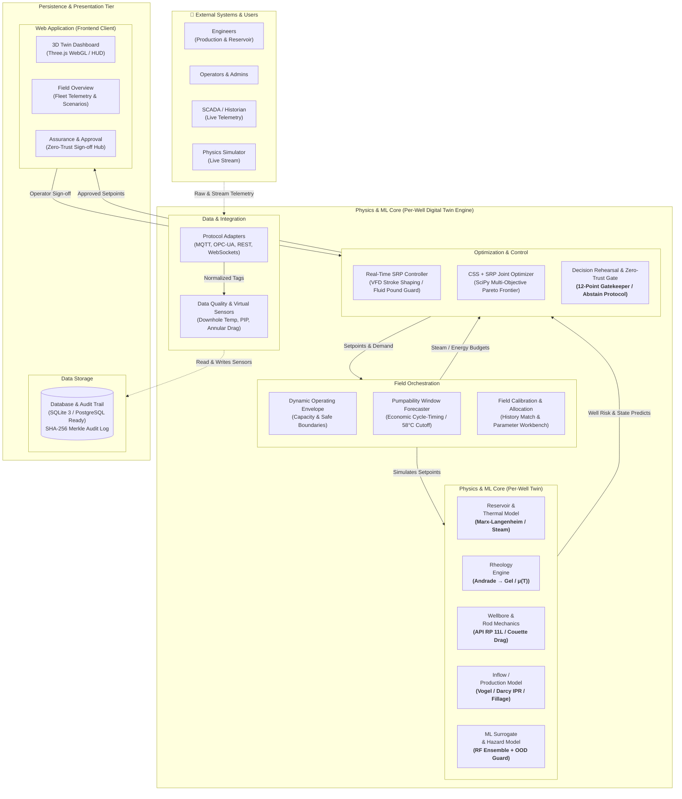

# SYSTEM_ARCHITECTURE.md — ASSURE-TWIN
## Complete Cyber-Physical System Architecture

**Project:** ASSURE-TWIN (Problem Statement SIH26120)  
**Field / Asset:** ONGC / OIL Baghewala Heavy Oil Field, Rajasthan  
**Status:** FULLY INTEGRATED & VERIFIED (94 Passing Automated Tests)

---

### 1. High-Level Architectural Diagram

> [!TIP]
> **Vector Diagram & Interactive Viewer Available:**
> - High-Resolution Vector SVG: [architecture_diagram.svg](file:///c:/Users/tejas/OneDrive/Desktop/Assure-Twin-3d_simulator/architecture_diagram.svg)
> - Standalone Interactive Viewer: [architecture_diagram.html](file:///c:/Users/tejas/OneDrive/Desktop/Assure-Twin-3d_simulator/architecture_diagram.html)

---

### 2. Tier-by-Tier Module & File Breakdown

#### Tier 1: Presentation & 3D WebGL Viewport
- **Entry Points:** `index.html`, `src/main.ts`.
- **Application Shell:** `src/ui/WorkstationApp.ts` (manages layout, 8-card KPI strip, top header, left navigation, drawer inspector, and report modal).
- **3D Graphics & Kinematics:**
  - `src/scene/PumpjackModel.ts`: Main 3D composite orchestrating surface and downhole assemblies.
  - `src/scene/pumping-unit/BaseAndSamsonPost.ts`: Concrete pad, wide-flange skid, 4-leg A-frame with K-lacing, OSHA ladder, safety cage, and crow's nest.
  - `src/scene/pumping-unit/DriveAndCrankAssembly.ts`: API 320/456 double-reduction gear reducer, 40 HP TEFC induction motor, V-belt guard, counterweight cranks.
  - `src/scene/pumping-unit/WalkingBeamAndHorsehead.ts`: API W24 wide-flange I-beam, curved horsehead, dual steel wire-rope bridles, carrier bar, polished rod.
  - `src/scene/pumping-unit/WellheadAssembly.ts`: API 6A flanged Christmas tree, master gate valves, 4-spoke red handwheels, stuffing box, pressure gauge, drip pan.
  - `src/kinematics/PumpjackKinematics.ts`: Solves exact closed-form circle-circle intersection linkage geometry on every frame.
- **Client Intelligence & Simulation Client:**
  - `src/sim/SimulationClient.ts`: WebSocket client communicating with `ws://127.0.0.1:8000/ws/sim` with built-in client-side fallback physics.
  - `src/assure/*`: 33 TypeScript intelligence modules implementing the complete OBSERVE $\rightarrow$ REHEARSE $\rightarrow$ ASSURE $\rightarrow$ CERTIFY workflow.

#### Tier 2: Decision Assurance & Governance
- **Safety Gatekeeper:** `backend/app/assurance/gatekeeper.py` (evaluates candidate recommendations against 12 independent thermo-mechanical checkpoints).
- **Abstain Protocol:** `backend/app/assurance/no_safe_recommendation.py` (suppresses setpoint generation and formats formal abstain contracts when boundaries fail).
- **Explainability:** `backend/app/assurance/why_engine.py` (generates causal physical explanations for *Why* a setpoint was chosen and *Why Not* for rejected counterfactuals).
- **Audit Trails:** `backend/app/assurance/audit_logger.py` (computes SHA-256 hashes for decision lineage).

#### Tier 3: Coupled Physics & Optimization Engine
- **Master Time-Stepper:** `backend/app/twin/time_stepper.py` (coordinates 15 physical domains per step).
- **Reservoir Thermodynamics:** `backend/app/physics/thermal.py` (Marx-Langenheim heat loss, steam front radius, overburden conduction).
- **Rheology & Fluid Dynamics:** `backend/app/physics/thermal.py:viscosity_andrade` (exponential temperature-viscosity transition).
- **Inflow Performance (IPR):** `backend/app/physics/inflow.py` (Vogel saturated, Darcy undersaturated, composite heavy-oil inflow).
- **Downhole Pump:** `backend/app/physics/pump.py` (volumetric displacement, pump fillage, valve leakage).
- **Rod Dynamics & Stress:** `backend/app/twin/time_stepper.py` (API RP 11L Couette shear drag, PPRL, MPRL, downstroke float margin).
- **Multi-Objective Optimization:** `backend/app/optimization/css_optimizer.py` (SciPy Differential Evolution optimizing steam timing and pump speed).
- **Decision Rehearsal:** `backend/app/forecast/rehearsal.py` (deep-clones state and forward-simulates 30 days in isolation).

#### Tier 4: Data Layer & Telemetry
- **FastAPI Core:** `backend/app/main.py`, `backend/app/api/v1/router.py`.
- **Database Schema:** `backend/app/models/entities.py`, `backend/app/database.py` (25 SQLAlchemy ORM tables).
- **Seeding:** `backend/app/seed.py` (idempotent seed of Baghewala field parameters, well BGW-17A, past CSS cycles, and calibration profiles).

---

### 3. Verification & Operational Health
- **Backend Test Suite:** 64 passed out of 64 tests (`pytest backend/tests/`).
- **Frontend Engine Suite:** 30 passed out of 30 tests (`npx tsx src/assure/tests/run_tests.ts`).
- **Total Test Verification:** 94 automated regression checks with 0 failures.
